# Corpus technology use graph

This editable Mermaid source mirrors the presentation-ready SVG in
`docs/technology-use-graph.svg`.

```mermaid
flowchart LR
  DEV[Developer / teammate]

  subgraph CLIENTS[AI clients and lifecycle]
    AGENTS[Codex · Claude Code · Gemini · MCP hosts]
    CLI[corpus-setup · connect · disconnect · status · ls · uninstall]
    CONFIG[Client MCP configs · instruction blocks · hooks]
    REGISTRY[Local workspace registry<br/>~/.corpus/workspaces.json]
    CLI --> CONFIG
    CLI --> REGISTRY
  end

  subgraph RUNTIME[Corpus TypeScript runtime — Node.js 18+]
    MCP[MCP SDK server<br/>stdio transport + Zod schemas]
    LOAD[corpus_load<br/>targeted Markdown recall]
    LOG[corpus_log<br/>incremental ledger]
    SAVE[corpus_save<br/>structured handoff]
    SEARCH[codebase_search<br/>structural query]
    INIT[corpus_init<br/>seed architecture]
    MERGE[Markdown merge engine<br/>rewrite state · append history]
    STORE{DocumentStore}
    MCP --> LOAD & LOG & SAVE & SEARCH & INIT
    LOAD --> STORE
    LOG --> MERGE --> STORE
    SAVE --> MERGE
    INIT --> MERGE
  end

  GRAPHIFY[Graphify<br/>tree-sitter local code graph]
  LOCAL[LocalStore<br/>~/.corpus/project Markdown]
  OFF[DisconnectedStore<br/>memory safely off]

  subgraph DATA[Supabase — PostgreSQL + PostgREST + Realtime]
    WS[(workspaces<br/>canonical UUID identity)]
    MEMBERS[(workspace_members<br/>Auth0 sub · role · status)]
    DOCS[(documents<br/>workspace + name + Markdown)]
    EVENTS[(usage_events<br/>tool · agent · tokens · baseline)]
    STATS[[usage_stats view]]
    OVERVIEW[[project_overview view]]
    RT[[Realtime publication]]
    WS --> MEMBERS
    WS --> DOCS
    EVENTS --> STATS
    WS --> OVERVIEW
    DOCS --> OVERVIEW
    DOCS --> RT
    MEMBERS --> RT
    EVENTS --> RT
  end

  subgraph WEB[Next.js 16 / React 19 dashboard]
    AUTH[Auth0 session + user identity]
    APP[App Router server shell + client UI]
    API[Server data layer + document/workspace APIs]
    BROWSER[Supabase browser anon client]
    FORCE[react-force-graph-2d<br/>memory graph + search]
    MD[react-markdown + remark-gfm<br/>view/edit documentation]
    LEDGER[Usage/token ledger + connections]
    APP --> FORCE & MD & LEDGER
    AUTH --> API
    APP --> API
    BROWSER --> APP
  end

  DEV --> AGENTS
  DEV --> APP
  AGENTS <-->|MCP over stdio| MCP
  CONFIG --> AGENTS
  SEARCH --> GRAPHIFY
  INIT --> GRAPHIFY
  STORE -->|shared canonical path| WS
  STORE --> DOCS
  STORE --> EVENTS
  STORE -. zero-config fallback .-> LOCAL
  STORE -. unreachable connected workspace .-> OFF
  API <-->|server-side reads and writes| DATA
  RT -->|change events, then debounced refetch| BROWSER
  MEMBERS -->|dashboard authorization| AUTH

  classDef runtime fill:#191a39,stroke:#6f66d9,color:#f3f6ff;
  classDef data fill:#102a25,stroke:#3da578,color:#f3f6ff;
  classDef web fill:#102a35,stroke:#3a9bb1,color:#f3f6ff;
  class MCP,LOAD,LOG,SAVE,SEARCH,INIT,MERGE,STORE runtime;
  class WS,MEMBERS,DOCS,EVENTS,STATS,OVERVIEW,RT data;
  class AUTH,APP,API,BROWSER,FORCE,MD,LEDGER web;
```

## Trust boundaries

- Dashboard users authenticate through Auth0; `workspace_members` controls what their
  dashboard can see and edit.
- The MCP server currently connects with the Supabase service-role key. The workspace UUID
  acts as the CLI bearer credential, so MCP writes do not currently enforce Auth0 membership.
- Graphify and the local fallback store remain on the developer machine. Corpus does not
  write generated memory files into the target Git repository.

## Primary technology inventory

- Frontend: Next.js 16.2, React 19.2, TypeScript 5, Tailwind CSS 4, GSAP,
  react-force-graph-2d, react-markdown, and remark-gfm.
- Identity and data: Auth0, Supabase JavaScript client, PostgreSQL/PostgREST, and Supabase
  Realtime.
- Agent integration: Node.js 18+, TypeScript, Model Context Protocol SDK over stdio, and
  Zod tool schemas.
- Code intelligence: Graphify using a local tree-sitter-derived code graph; the Corpus
  server itself makes no LLM calls.
